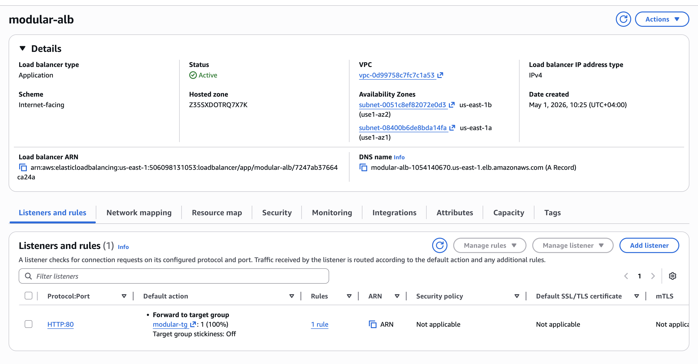
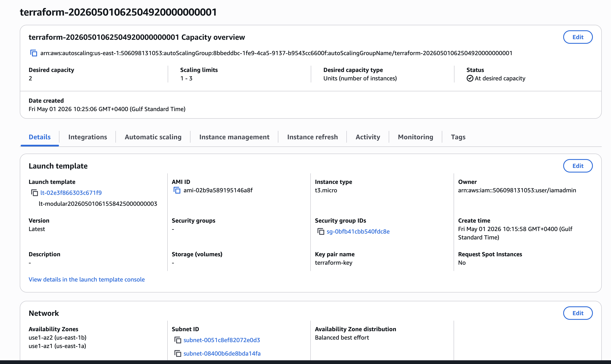

# 🚀 Terraform AWS CI/CD Modular Infrastructure

A production-style Infrastructure as Code (IaC) project built using Terraform and AWS.
It features a modular architecture, remote state management, observability layer (CloudWatch monitoring), and fully automated CI/CD using GitHub Actions.

## 📌 Project Overview

This project demonstrates how to design and deploy a scalable cloud infrastructure on AWS using Terraform.

It follows real-world DevOps best practices including:

    *  Modular Terraform architecture
    *  Remote state management (S3 + DynamoDB)
    *  CI/CD automation with GitHub Actions
    *  Infrastructure observability using CloudWatch
    *  Automated deployment on every push to main

## 🏗️ Architecture


#### The project deploys:

* VPC with public subnets
* Internet Gateway & Route Tables
* Security Groups
* EC2 instances (Auto Scaling enabled)
* Application Load Balancer (ALB)
* Target Groups
* Auto Scaling Group (ASG)
* S3 Remote Backend (State Storage)
* DynamoDB (State Locking)
* CloudWatch Monitoring & Dashboards ⭐ NEW
* CloudWatch Alarms (CPU, ALB errors)
* SNS Email Notifications
* CI/CD Pipeline (GitHub Actions)


## ⚙️ Tech Stack

 * Terraform
 * Amazon Web Services (AWS)
        - EC2
        - VPC
        - ALB (Elastic Load Balancer)
        - Auto Scaling Group
        - CloudWatch
        - SNS
        - S3
        - DynamoDB
 * GitHub Actions (CI/CD)
 * Linux (Amazon Linux 2)


## 📁 Project Structure

````
.
├── main.tf
├── provider.tf
├── backend.tf
├── variables.tf
├── outputs.tf
├── terraform.tfvars
├── modules/
│   ├── network/
│   ├── security/
│   ├── compute/
│   ├── alb/
│   ├── asg/
│   └── monitoring/   
└── .github/
    └── workflows/
        └── terraform.yml

````


## 🔄 CI/CD Pipeline

#### The GitHub Actions pipeline performs:

* Checkout repository
* Configure AWS credentials
* Initialize Terraform (terraform init)
* Terraform Format Check
* Validate configuration
* Plan infrastructure changes (terraform plan)
* Apply changes automatically (terraform apply)

## 🧠 CI/CD Enhancements Added:

* Terraform formatting enforcement (fmt -check)
* Validation stage before deployment
* Concurrency control to avoid state conflicts


## ☁️ Remote State Management

Terraform state is stored securely using:

    * S3 Bucket → Stores state file
    * DynamoDB Table → Handles state locking

This ensures safe collaboration and prevents concurrent modifications.


## 🚀 Deployment Workflow
Git Push → GitHub Actions → Terraform Init → Plan → Apply → AWS Infrastructure

## 🔐 Security

* IAM user with least-privilege access
* No hardcoded credentials
* GitHub Secrets used for AWS authentication
* State locking enabled via DynamoDB

## 📊 Observability & Monitoring 
This project now includes a full CloudWatch Observability Layer:

### 📈 CloudWatch Dashboard includes:

* EC2 CPU Utilization (ASG)
* ALB Request Count
* ALB Response Time
* ALB 5XX Error Rate
* ALB Healthy vs Unhealthy Hosts
* ASG Desired Capacity
* In-Service Instances

### 🚨 CloudWatch Alarms:

* EC2 High CPU Alarm (>70%)
* ALB 5XX Error Alarm
* SNS email notifications for alerts

### 📄 Logging:

* CloudWatch Log Group for EC2 system/application logs


## 📸 Screenshots

#### 🔹 ALB Working in Browser


#### 🔹 GitHub Actions Pipeline


#### 🔹 AWS EC2 Instances, ALB, ASG, Target Group, DynamoDb, S3 Bucket,VPC







#### 🔹 Inline Policy created for GitHub actions


#### 🔹 CloudWatch dashboard


#### 🔹 Terraform Apply Output


## Challenges Faced

* Resolved Terraform state locking conflicts
* Debugged GitHub Actions deployment failures
* Fixed IAM permission issues for CI/CD pipeline
* Configured proper ALB and target group health checks
* Solved Terraform module dependency issues
* Managed remote backend configuration for collaborative workflows


## 🧠 Key Learnings

* Modular Terraform architecture design
* Infrastructure as Code best practices
* AWS networking and compute services
* CI/CD automation using GitHub Actions
* Remote state management using S3 + DynamoDB
* Secure IAM-based authentication
* CloudWatch observability & monitoring design 


## 🎯 Outcome

This project simulates a real-world production cloud environment, enabling:

    * Fully automated infrastructure deployment
    * Scalable and fault-tolerant architecture
    * Secure and version-controlled cloud setup
    * Observability and monitoring enabled system

## 📌 How to Use

### Clone repository
````
git clone <repo-url>
````

### Initialize Terraform
````
terraform init
````

### Plan infrastructure
````
terraform plan
````

### Apply infrastructure
````
terraform apply
````

## 💡 Future Improvements

* HTTPS with Route53 + ACM
* Blue/Green deployments
* Multi-environment setup (dev/staging/prod)
* CloudWatch Log Insights dashboards
* Cost optimization (AWS Budgets expansion)
* Centralized logging system (advanced)


## 👨‍💻 Author

### Fathima Yosra

AWS Cloud & DevOps Engineer

Focused on AWS, Terraform, and CI/CD automation.

⭐ If you like this project

Give it a ⭐ on GitHub and follow for more DevOps projects.